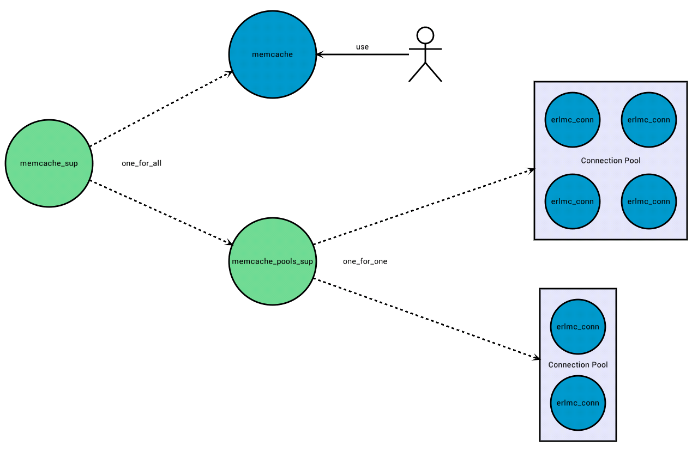

<!---
@doc <!-- -->

<h3> Purpose </h3>

This application is able to start/stop memcached instances in the host where it runs and also offer
configurable connection pools to interact with those instances or others that may be running
(locally or remotely).

From a user point of view, the memcache.erl module is the library interface and the only one that
should be interacted with.

Internally, this library is a wrapper around poolboy and erlmc_conn. The first one is used to create a pool of
connections, while the latter creates a persistent connection to Memcached using its binary protocol.

<h3> Features </h3>

<li> Automatically start a local Memcached instance</li>
<li> Supervision of the local Memcached instance if it was started by this app</li>
<li> (Named) Pools and their management</li>
<li> Statistics retrieval from Memcached</li>

<h3> Configuration </h3>

This application uses the following configuration keys:
    <li>start_memcached: a string template with placeholders for 3 variables: Host (string), Memory
    and Port (integers).</li>
    <li>stop_memcached: a string template with placeholders for 2 variables: Host (string) and Port
    (integer).</li>
    <li>pools: a proplist with {Poolname, Poolproperties} tuples, where Poolname is an atom and
    PoolProperties is a proplist with the following elements:
        <li>size: an integer with the amount of connections per pool</li>
        <li>max_overflow: integer</li>
        <li>port: integer</li>
        <li>host: string</li>
        <li>opts: a proplists with options applicable only when starting the memcached server.
        Currently only memory is supported </li>
        <li>start: whether this application should be responsible for starting memcached or not
        (boolean)</li>
    </li>

An example of configuration follows:
<code>
[
	{memcache,
		[{pools,
			[{yaddapool, [
                {size, 10},
                {max_overflow, 20},
                {port, 3333},
                {host, "localhost"},
                {opts, [{memory, 4}]},
                {start_server, true}
            ]}]
        }]
    }
]
</code>

<h3> Notes </h3>
<li> Currently only the memory of a memcached instance (-m) can be set</li>
<li> Local memcached instances are started and stopped via os commands</li>
<li> This application has been tested with memcached 1.4.4 un CentOS 5 and 6 and 1.4.13 in Ubuntu
12.04 using Erlang R15B0[1-3]</li>
